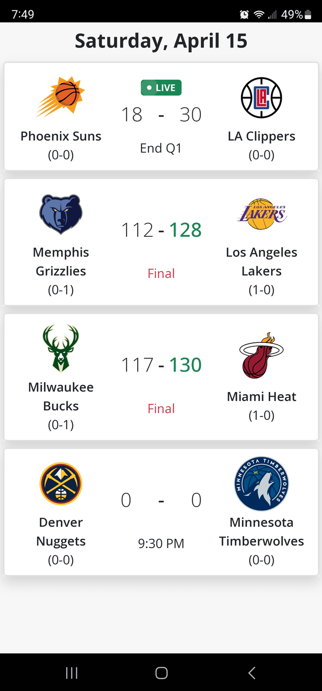
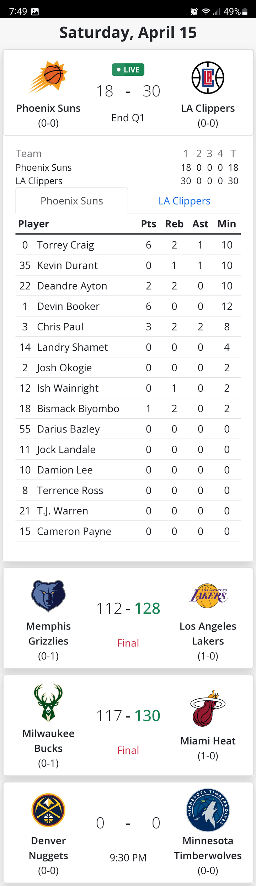

# NBA Live Scoreboards

This is a progressive web app built with ReactJS that displays live NBA scoreboards as Bootstrap accordion cards. Each card shows basic details about the game, such as the teams playing, the current score, and the time remaining in the game. Tapping a card will reveal more detailed information about the game, such as the scoring summary and player statistics. The data is from a python backend [server](https://github.com/Blizzcane/sports-server) built with Flask. Visit the app [here](https://scoreboard-omega.vercel.app/). Since this is using a free tier, please note that the first load after 15 minutes of inactivity may take a bit longer to spin up.

## Features

- View live NBA scores and game details
- Detailed game view with scoring summary and player statistics
- Unique user interface with Bootstrap accordion cards

## Screenshots
 
 
 

## Installation

To install this project, follow these steps:

1. Clone this repository to your local machine.
2. Navigate to the project directory in your terminal.
3. Run `npm install` to install the project dependencies.

## Usage

To run the project, run `npm start` in the project directory. This will start the development server and open the app in your browser.

## Contributing

Contributions to this project are welcome. To contribute:

1. Fork this repository.
2. Create a new branch for your changes.
3. Make your changes and commit them.
4. Push your changes to your fork.
5. Submit a pull request to this repository.

## User Guide

To use this app, simply visit the [link](https://scoreboard-omega.vercel.app/) and tap on a game to view more detailed information.  
 
